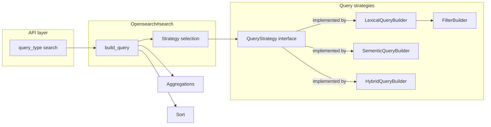

# 5. Refactor OpenSearch query building with Builder and Strategy patterns

Date: 2026-02-02

## Status

Accepted

## Context

The `Opensearch` model (`app/models/opensearch.rb`) has grown into a large, monolithic class (≈360+ lines). 

The model:

- Builds the entire OpenSearch request body (query, aggregations, sort, highlight) in one place.
- Mixes multiple concerns:
  - Lexical query construction (multi_match, single-field matches, nested matches).
  - Geographic constraints (geodistance, bounding box).
  - Aggregation filters (contributors, formats, languages, access rights, etc.).
  - Top-level request assembly and client invocation.
- Is already difficult to understand and extend safely. We know we will soon add **semantic** and **hybrid** (lexical + semantic) search behaviors, which will further increase complexity.

Current state:

- The GraphQL `search` field (`app/graphql/types/query_type.rb`) is the main entry point and calls `Opensearch.new.search(...)`.
- All lexical and geo query construction is hardcoded inside `Opensearch#query`, `#matches`, `#multisearch`, and various helper methods.
- Filter logic (`filters`, `filter_field_by_value`, etc.) is also embedded in the same class.

We want to:

- Make the query-building logic easier to understand and test in isolation.
- Prepare for additional query modes (semantic, hybrid).
- Keep the **external API and behavior unchanged** for now (same GraphQL schema, same OpenSearch request shape).

## Decision

We will refactor the `Opensearch` model to introduce:

1. **A query strategy abstraction (Strategy pattern)**  
   - Define a simple query-strategy contract, e.g. a module `Opensearch::QueryStrategy` with a single method:
     - `build(params, fulltext) # => Hash`
   - `Opensearch.search` will:
     - Select a query strategy (for now, always the lexical strategy).
     - Delegate query construction to `strategy.build(params, fulltext)` inside `build_query`.
   - Future query modes (semantic, hybrid) will be modeled as additional strategies that implement the same interface.
   - NOTE: **we could choose to defer implementation of the Strategy abstraction** and focus solely on the Builders at this time. It is relatively simple, this is not a requirement to gain the core benefits of this refactor.

2. **A lexical query builder as the first strategy (Builder + Strategy)**  
   - Create `Opensearch::LexicalQueryBuilder` (e.g. `app/models/opensearch/lexical_query_builder.rb`), which:
     - Implements the `QueryStrategy` interface.
     - Encapsulates the current “lexical” query behavior:
       - bool query structure (must/should/filter).
       - `multisearch` (prefix/term boosts for title, contributors, etc.).
       - `matches` for main `q`.
       - Single-field and nested matches (citation, title, contributors, subjects, etc.).
       - Geographic clauses (geodistance, bounding box) as part of the overall bool query.
     - Uses `FilterBuilder` (see next item) for the filter portion of the bool query.
   - **`Opensearch` becomes an orchestrator**:
     - It builds the top-level request: `from`, `size`, `query` (via strategy), `aggregations`, `sort`, and optional `highlight`.
     - It no longer encodes the detailed lexical/geo/field logic directly.

3. **A dedicated filter builder (Builder pattern)**  
   - Create `Opensearch::FilterBuilder` (e.g. `app/models/opensearch/filter_builder.rb`).
   - Move all aggregation/filter-related responsibilities out of `Opensearch`:
     - `filters`
     - `filter_field_by_value`
     - `filter_sources` / `source_array`
     - `filter_access_to_files` / `access_to_files_array`
   - `FilterBuilder` will:
     - Accept the search params.
     - Return the array of filter clauses used in the OpenSearch query.
   - This builder is anticipated to be reusable in future strategies which is why it is pulled out of `LexicalQueryBuilder`.

4. **A dedicated sort builder**
   - While sort is currently extremely simple, we'll take this opportunity to move it out of OpenSearch to simplify the OpenSearch class.
   - This will prepare us for additional sort algorithms, but mostly this move is to simplify the main OpenSearch class.

5. **No external API or behavior changes**  
   - The signature of `Opensearch#search` remains the same.
   - The GraphQL schema and `construct_query` behavior remain unchanged.
   - The shape of the OpenSearch request (including query, filters, aggregations, sort, highlight) is preserved.
   - Existing tests (including VCR-based tests) should continue to pass unchanged.

## Consequences

### Positive

- **Improved maintainability and readability**  
  - `Opensearch` is smaller and focused on orchestration and top-level request assembly.
  - Lexical query details and filter details are encapsulated in dedicated classes.

- **Better testability**  
  - `FilterBuilder` and `LexicalQueryBuilder` can be unit-tested in isolation:
    - Given specific params, they produce well-defined hash structures.
  - We can more easily assert on the shape of queries and filters without coupling to client calls.

- **Clear extension point for future features**  
  - Semantic and hybrid search can be added later by:
    - Implementing new query strategies (e.g. `SemanticQueryStrategy`, `HybridQueryStrategy`) that conform to the same `build(params, fulltext)` interface.
    - Reusing `FilterBuilder` for aggregation filters and geo constraints.
    - Adding a small “strategy selection” step in `Opensearch` (e.g. based on a `search_mode` param).
  - This prepares us to focus solely on the semantic/hybrid work when we get to that rather than trying to introduce a refactor with a new feature.

- **Easier incremental refactors**  
  - Additional internal refactoring (e.g. introducing a `SearchParams` value object or specialized helpers for geo) can be done within builders/strategies without touching the external API.

### Negative / Trade-offs

- **More classes and indirection**  
  - Adding `FilterBuilder`, `QueryStrategy`, and `LexicalQueryBuilder` increases the number of moving parts.
  - Developers must follow the new abstractions to trace how a query is built.

- **Short-term refactor cost**  
  - Code must be carefully moved to avoid breaking existing behavior and VCR tests.
  - There is some overhead in introducing new tests for `FilterBuilder` and `LexicalQueryBuilder`.

### Out of scope

- **Semantic and hybrid search are not implemented in this decision**  
  - No k-NN/vector fields, Neural Search configuration, or hybrid score combination are added here.
  - No new GraphQL arguments (e.g. `searchMode`) are introduced at this time.
  - Index mappings, ingest pipelines, and model selection remain unchanged.

These will be covered by future ADR(s) once we are ready to add semantic and hybrid query capabilities on top of the refactored structure.

## Notes

A simplified view of the target architecture (including future state of Semantic/Hybrid builders):

