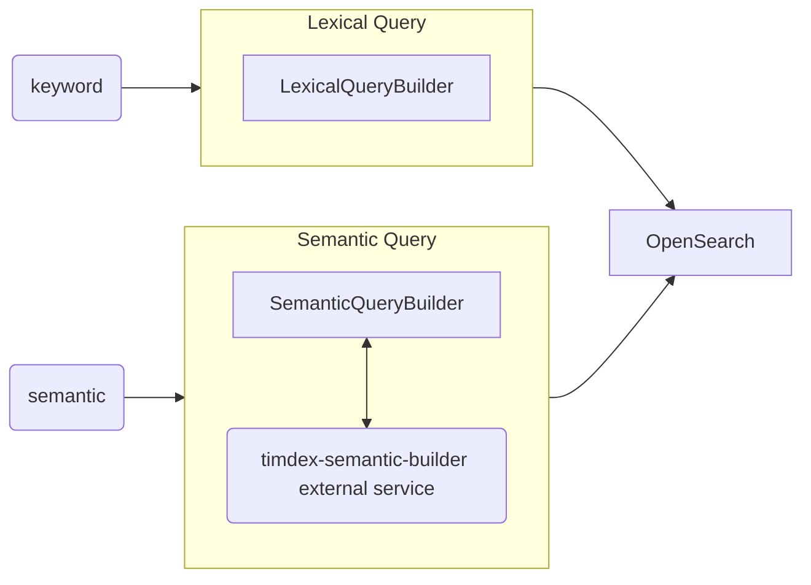

# 7. Semantic Query Processing

Date: 2026-02-27

## Status

Accepted

## Context

We will be using doc-only embedding rather than Bi-encoding (query and document). This distinction is summarized by the [OpenSearch blog](https://opensearch.org/blog/improving-document-retrieval-with-sparse-semantic-encoders/) as follows:

> In bi-encoder mode, both documents and search queries are passed through deep encoders.
> In document-only mode, documents are still passed through deep encoders, but search queries are instead tokenized.

Our OpenSearch may run in AWS OpenSearch Serverless architecture, which prevents us from installing our own models directly in OpenSearch. Therefore, we need to create our tokens to construct a query outside of OpenSearch.

The specific details on how the will be implemented is not a concerns of this TIMDEX API codebase, but we do care about the information flow which is described below. At a high level, we will be calling an external tool to transform a text string (a user query) into a query structure that we can use in our SemanticQueryBuilder and HybridQueryBuilder.

### Example semantic query structure

We anticipate that for an input of "hello world", we should expect a response similar to:

```json
{
  "query": {
    "bool": {
      "should": [
        {
          "rank_feature": {
            "field": "embedding_full_record.[CLS]",
            "boost": 1.0
          }
        },
        {
          "rank_feature": {
            "field": "embedding_full_record.[SEP]",
            "boost": 1.0
          }
        },
        {
          "rank_feature": {
            "field": "embedding_full_record.world",
            "boost": 3.4208686351776123
          }
        },
        {
          "rank_feature": {
            "field": "embedding_full_record.hello",
            "boost": 6.937756538391113
          }
        }
      ]
    }
  }
}
```

### Semantic and Lexical query flows



Keyword, or lexical, queries will be handled entirely in this repository codebase.

Semantic queries will be coordinated in this repository codebase, but constructed by a separate external service. The libraries necessary to create the query structure are python libraries and thus can't be done entirely in this ruby codebase.

Hybrid queries are not in the diagram, but generally consist of sending a single combined query that consists of both lexical and semantic parts. Hybrid can thus be exepected to call both LexicalQueryBuilder and SemanticQueryBuilder to construct the single OpenSearch query.

## Decision

We will develop a separate tool (`timdex-semantic-builder` in diagram) outside of TIMDEX API that will accept a user query and return a semantic query structure ready to be used in our Semantic and Hybrid query builders.

## Consequences

By using an external tool, rather than running the model directly in OpenSearch we are able to consider moving to OpenSearch Serverless which may be easier to manage longterm.

We also get to control the query construction more directly, which might end up being useful.

This does mean we will need to mantain an additional tool to generate semantic queries and that we will need to make an additional external call (likely to a lambda, but not decided yet) during semantic query construction which will introduce some amount of latency.
